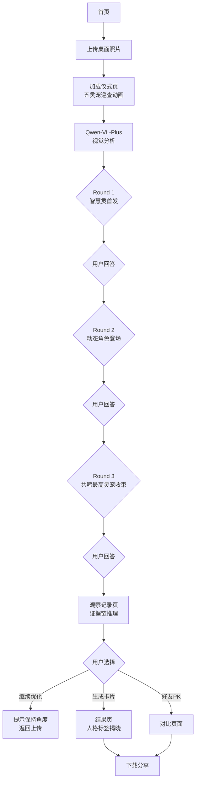
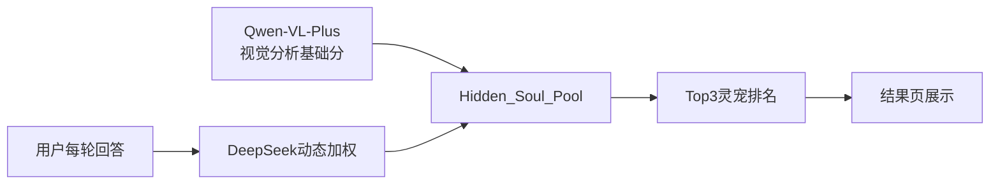

# 灵瑞集·桌灵档案馆 - 产品需求文档 (PRD)

## 1. 产品概述

五位来自灵瑞集的守护灵宠，通过观察你的桌面空间与生活痕迹，陪伴你完成一次关于习惯、情绪与成长的灵居探索之旅。

- **核心价值**：空间整理功能（70%科学收纳建议）+ 心理人格分析（固定主人格+动态副人格）+ 灵宠叙事陪伴（情感递进与成长记录）
- **目标用户**：追求生活品质、喜欢心理测试、对灵宠IP感兴趣的年轻用户群体

## 2. 核心功能

### 2.1 用户角色
| 角色 | 注册方式 | 核心权限 |
|------|----------|----------|
| 访客用户 | 无需注册 | 完整体验所有功能，数据仅存Session |

### 2.2 功能模块
1. **首页/启动页**：品牌展示、开始体验入口
2. **上传页面**：桌面照片上传、拍照引导
3. **加载仪式页**：五灵宠巡查动画、流式文案轮播
4. **对话页面**：三轮灵宠对话交互、隐藏分池计算
5. **观察记录页**：证据链推理、灵居气息观察、整理建议
6. **结果页**：守护灵共鸣图、人格标签、分享卡片
7. **成长对比页**：纵向成长记录、好友PK

### 2.3 页面详情
| 页面名称 | 模块名称 | 功能描述 |
|----------|----------|----------|
| 首页 | Hero区域 | 品牌Logo、五灵宠形象展示、开始体验按钮 |
| 首页 | 引导说明 | 简要使用说明、隐私声明 |
| 上传页 | 拍照引导 | 最佳拍摄角度提示、光线建议 |
| 上传页 | 上传组件 | 相册选择/相机拍照、图片预览 |
| 加载页 | 灵宠动画 | 五灵宠巡查桌面粒子特效 |
| 加载页 | 文案轮播 | 流式滚动文案（智慧灵整理线索→奇想灵搜集碎片→守护灵感知气息→建立共鸣模型→寻找守护灵） |
| 对话页 | 灵宠形象 | 当前发言灵宠动态展示 |
| 对话页 | 对话气泡 | 灵宠提问、用户回答输入框 |
| 对话页 | 进度指示 | 当前轮次（1/3、2/3、3/3） |
| 观察记录页 | 证据链推理 | 桌面现象×用户回答→推理逻辑→心境映射 |
| 观察记录页 | 灵居气息 | 东方文化趣味解读（禁用"风水"字眼） |
| 观察记录页 | 整理建议 | 科学建议70%+灵居建议30% |
| 观察记录页 | 操作按钮 | 继续优化、生成卡片、好友PK |
| 结果页 | 守护灵大图 | 共鸣最高灵宠精美插图+名称+共鸣度 |
| 结果页 | Top3排名 | 五灵宠共鸣度排名展示 |
| 结果页 | 人格标签 | 固定主人格（15-20个预设库） |
| 结果页 | 动态副人格 | DeepSeek生成的趣味一句话描述 |
| 结果页 | 共鸣原因 | 3条高度凝练短句 |
| 结果页 | 分享操作 | 下载卡片、好友PK按钮 |
| 成长对比页 | 差量感知 | 新老照片布局变化对比 |
| 成长对比页 | 情感对白 | 灵宠温情成长语录 |

## 3. 核心流程

### 3.1 主流程描述
用户进入应用 → 上传桌面照片 → AI视觉分析（Qwen-VL-Plus）→ 三轮流式对话（DeepSeek-V4-Flash）→ 观察记录展示 → 选择继续优化或生成结果 → 结果页展示 → 分享/对比

### 3.2 流程图


### 3.3 隐藏分池计算流程


## 4. 用户界面设计

### 4.1 设计风格
- **主色调**：灵瑞集品牌色系 - 温暖的琥珀金(#D4A574)作为主色，深邃的墨蓝(#1A1F3D)作为背景，点缀灵性紫(#8B5CF6)和治愈绿(#10B981)
- **按钮风格**：圆角胶囊按钮，带有柔和渐变和微妙阴影，hover时有呼吸灯效果
- **字体**：标题使用"思源宋体"或"霞鹜文楷"体现东方韵味，正文使用"思源黑体"保证可读性
- **布局风格**：卡片式布局，中心对称，大量留白营造禅意空间感
- **图标/装饰**：灵宠Q版形象、粒子光效、水墨晕染背景元素

### 4.2 页面设计概览
| 页面名称 | 模块名称 | UI元素 |
|----------|----------|--------|
| 首页 | Hero区域 | 全屏渐变背景、居中Logo、五灵宠剪影环绕、呼吸灯效果开始按钮 |
| 上传页 | 拍照引导 | 虚线框拍照区域、角度示意图标、光线提示气泡 |
| 加载页 | 灵宠动画 | 五灵宠粒子轨迹动画、呼吸灯背景、流式文案打字机效果 |
| 对话页 | 灵宠形象 | 左侧灵宠动态立绘、右侧对话气泡、底部输入框、顶部进度条 |
| 观察记录页 | 证据卡片 | 堆叠式卡片布局、证据链连接线、灵居气息装饰边框 |
| 结果页 | 守护灵展示 | 大图居中、共鸣度环形进度、人格标签徽章、分享按钮组 |
| 成长对比页 | 对比视图 | 左右分屏对比、变化高亮标注、温情语录浮动卡片 |

### 4.3 响应式设计
- **桌面优先**：主要针对桌面端设计，保证大屏幕沉浸体验
- **移动适配**：响应式布局适配手机屏幕，结果页保证一屏看全
- **触控优化**：按钮尺寸适配触控，滑动操作流畅

### 4.4 动效设计
- **页面转场**：淡入淡出配合灵宠粒子飘散
- **加载动画**：五灵宠巡查轨迹动画，粒子汇聚成灵宠轮廓
- **对话交互**：灵宠说话时轻微摇晃，气泡弹出弹性动画
- **结果揭晓**：守护灵大图渐现，共鸣度数字滚动增长

## 5. AI角色系统

### 5.1 五灵宠定义
| 灵宠名称 | 核心职责 | 关注物品 | 心理映射 | 语言风格 |
|----------|----------|----------|----------|----------|
| 智慧灵 | 专注力、学习能力 | 书籍、电脑、工作区 | 思维过载、认知专注度 | 理性沉稳、善用比喻 |
| 活力灵 | 行动力、执行力 | ToDo便签、项目材料 | 拖延症、行动能量 | 活泼直率、鼓励为主 |
| 治愈灵 | 情绪状态、共情 | 收藏物、照片、潮玩 | 心理防线、疲惫感 | 温柔细腻、善解人意 |
| 奇想灵 | 创造力、灵感 | 手办、草稿纸、灵感碎片 | 精神内耗、创意活跃度 | 天马行空、脑洞大开 |
| 守护灵 | 安全感、作息 | 药品、水杯、睡眠痕迹 | 亚健康信号、作息规律 | 关怀备至、细心周到 |

### 5.2 对话规则
- **提问公式**：发现桌面现象 → 提出心境猜测 → 是/否验证
- **容错机制**：用户回答"不是/不知道/随便"时，立即切换角度，保持温柔陪伴
- **禁止事项**：严禁质疑用户、严禁开放式深度问题、严禁使用"风水学"字眼

## 6. 数据结构

### 6.1 隐藏分池结构
```json
{
  "wisdom": 0,
  "vitality": 0,
  "healing": 0,
  "fantasy": 0,
  "guardian": 0
}
```

### 6.2 主人格库（15-20个预设）
- 执行派建筑师
- 灵感捕手
- 温暖守护者
- 思维建筑师
- 创意炼金师
- ...等

### 6.3 Session数据结构
```typescript
interface SessionData {
  photoUrl: string;
  visualAnalysis: VisualAnalysisResult;
  dialogueHistory: DialogueRound[];
  hiddenSoulPool: SoulPool;
  currentRound: number;
  currentSpeaker: SpiritType;
  observationRecord: ObservationRecord;
  finalResult: FinalResult | null;
}
```