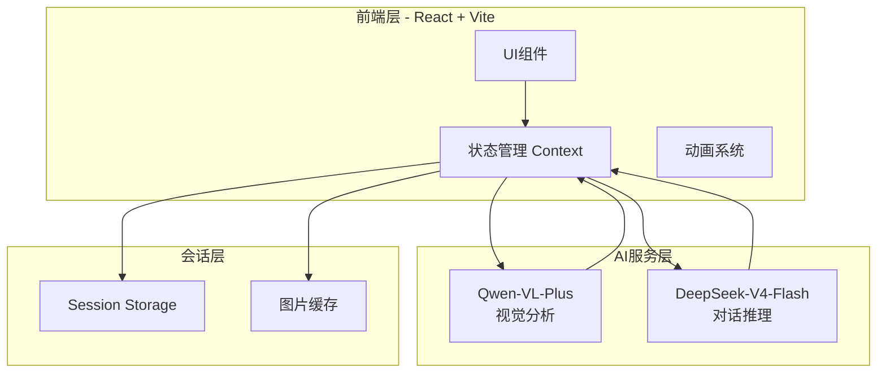
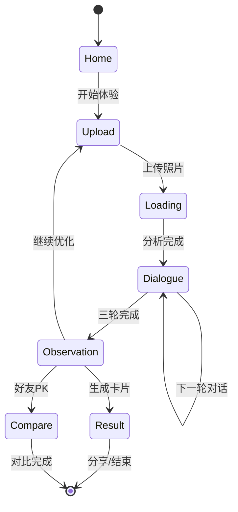

# 灵瑞集·桌灵档案馆 - 技术架构文档

## 1. 架构设计



## 2. 技术选型

### 2.1 前端技术栈
- **框架**：React 18 + TypeScript
- **构建工具**：Vite 5
- **样式方案**：Tailwind CSS 3 + CSS Modules
- **动画库**：Framer Motion
- **状态管理**：React Context + useReducer
- **路由**：React Router 6

### 2.2 AI服务集成
- **视觉分析**：Qwen-VL-Plus API（多模态图像识别）
- **对话推理**：DeepSeek-V4-Flash API（流式对话）
- **调用方式**：前端直接调用（API Key通过环境变量配置）

### 2.3 数据存储
- **会话数据**：Session Storage（隐私保护，即用即走）
- **图片缓存**：IndexedDB（可选，用于成长对比）
- **无后端**：纯前端架构，无需数据库

## 3. 路由定义

| 路由 | 页面 | 描述 |
|------|------|------|
| `/` | 首页 | 品牌展示、开始体验入口 |
| `/upload` | 上传页 | 桌面照片上传、拍照引导 |
| `/loading` | 加载页 | 五灵宠巡查动画、AI分析中 |
| `/dialogue` | 对话页 | 三轮流式对话交互 |
| `/observation` | 观察记录页 | 证据链推理、整理建议 |
| `/result` | 结果页 | 守护灵共鸣图、人格标签、分享 |
| `/compare` | 对比页 | 成长记录、好友PK |

## 4. API接口定义

### 4.1 Qwen-VL-Plus 视觉分析接口

```typescript
// 请求参数
interface VisualAnalysisRequest {
  image: string; // Base64编码图片
  prompt: string; // 视觉分析Prompt
}

// 响应结果
interface VisualAnalysisResult {
  objects: DetectedObject[]; // 检测到的物品
  gridValues: GridValues; // 16宫格初始值
  hiddenDoubts: string; // 隐藏疑点（传递给下一轮）
  spiritScores: InitialSpiritScores; // 初始灵宠分数
}

interface DetectedObject {
  name: string;
  category: 'wisdom' | 'vitality' | 'healing' | 'fantasy' | 'guardian';
  position: { x: number; y: number };
  confidence: number;
}

interface GridValues {
  // 4x4网格，每个格子0-100
  grid: number[][];
}

interface InitialSpiritScores {
  wisdom: number;
  vitality: number;
  healing: number;
  fantasy: number;
  guardian: number;
}
```

### 4.2 DeepSeek-V4-Flash 对话接口

```typescript
// 对话请求
interface DialogueRequest {
  round: 1 | 2 | 3;
  visualContext: VisualAnalysisResult;
  dialogueHistory: DialogueMessage[];
  hiddenSoulPool: SoulPool;
  userAnswer?: string;
}

// 对话响应
interface DialogueResponse {
  speaker: SpiritType;
  message: string;
  question?: string; // 下一轮问题
  soulPoolAdjustment: SoulPoolAdjustment;
  isComplete: boolean;
  interjection?: Interjection; // 插话彩蛋
}

type SpiritType = 'wisdom' | 'vitality' | 'healing' | 'fantasy' | 'guardian';

interface SoulPool {
  wisdom: number;
  vitality: number;
  healing: number;
  fantasy: number;
  guardian: number;
}

interface SoulPoolAdjustment {
  spirit: SpiritType;
  delta: number; // -10 到 +10
  reason: string;
}

interface Interjection {
  speaker: SpiritType;
  message: string;
}

interface DialogueMessage {
  role: 'spirit' | 'user';
  speaker: SpiritType;
  content: string;
  timestamp: number;
}
```

### 4.3 结果生成接口

```typescript
// 结果生成请求
interface ResultGenerationRequest {
  dialogueHistory: DialogueMessage[];
  hiddenSoulPool: SoulPool;
  visualContext: VisualAnalysisResult;
}

// 最终结果
interface FinalResult {
  primarySpirit: SpiritType;
  primaryResonance: number; // 0-100
  top3Spirits: Array<{
    spirit: SpiritType;
    resonance: number;
  }>;
  personalityTag: string; // 主人格标签
  dynamicPersonality: string; // 动态副人格
  resonanceReasons: string[]; // 3条共鸣原因
  spiritImageUrl: string; // 守护灵图片URL
}

// 观察记录
interface ObservationRecord {
  evidenceChain: string; // 证据链推理
  spiritObservation: string; // 灵居气息观察
  scientificAdvice: string[]; // 科学建议
  spiritAdvice: string[]; // 灵居建议
}
```

## 5. 状态管理架构

### 5.1 全局状态结构

```typescript
interface AppState {
  // 当前阶段
  stage: 'home' | 'upload' | 'loading' | 'dialogue' | 'observation' | 'result' | 'compare';
  
  // 图片数据
  photoUrl: string | null;
  photoHistory: PhotoHistoryItem[];
  
  // AI分析结果
  visualAnalysis: VisualAnalysisResult | null;
  
  // 对话数据
  dialogueHistory: DialogueMessage[];
  currentRound: number;
  currentSpeaker: SpiritType | null;
  
  // 隐藏分池
  hiddenSoulPool: SoulPool;
  
  // 观察记录
  observationRecord: ObservationRecord | null;
  
  // 最终结果
  finalResult: FinalResult | null;
  
  // UI状态
  isLoading: boolean;
  loadingMessage: string;
  error: string | null;
}
```

### 5.2 状态流转图



## 6. 组件架构

### 6.1 组件树

```
App
├── Layout
│   ├── Header
│   └── Footer
├── Router
│   ├── HomePage
│   │   ├── HeroSection
│   │   ├── SpiritShowcase
│   │   └── StartButton
│   ├── UploadPage
│   │   ├── PhotoGuide
│   │   ├── UploadZone
│   │   └── PreviewModal
│   ├── LoadingPage
│   │   ├── SpiritAnimation
│   │   ├── ParticleEffect
│   │   └── LoadingMessages
│   ├── DialoguePage
│   │   ├── SpiritAvatar
│   │   ├── ChatBubble
│   │   ├── InputArea
│   │   └── ProgressIndicator
│   ├── ObservationPage
│   │   ├── EvidenceChain
│   │   ├── SpiritObservation
│   │   ├── AdviceCards
│   │   └── ActionButtons
│   ├── ResultPage
│   │   ├── SpiritHero
│   │   ├── ResonanceRanking
│   │   ├── PersonalityTag
│   │   ├── DynamicPersonality
│   │   ├── ResonanceReasons
│   │   └── ShareActions
│   └── ComparePage
│       ├── PhotoComparison
│       ├── GrowthQuote
│       └── PKResult
└── SharedComponents
    ├── SpiritImage
    ├── LoadingSpinner
    ├── Toast
    └── Modal
```

### 6.2 核心组件说明

| 组件名 | 功能 | 关键Props |
|--------|------|-----------|
| SpiritAvatar | 灵宠动态立绘 | spirit, emotion, isSpeaking |
| ChatBubble | 对话气泡 | message, speaker, type |
| ResonanceRanking | 共鸣度排名 | top3Spirits, maxResonance |
| EvidenceChain | 证据链展示 | evidences, connections |
| PhotoComparison | 照片对比 | beforePhoto, afterPhoto, highlights |

## 7. 动画系统

### 7.1 页面转场动画
```typescript
const pageTransition = {
  initial: { opacity: 0, y: 20 },
  animate: { opacity: 1, y: 0 },
  exit: { opacity: 0, y: -20 },
  transition: { duration: 0.5 }
};
```

### 7.2 灵宠动画
```typescript
const spiritAnimations = {
  idle: {
    y: [0, -10, 0],
    transition: { duration: 2, repeat: Infinity }
  },
  speaking: {
    scale: [1, 1.05, 1],
    rotate: [-2, 2, -2],
    transition: { duration: 0.5, repeat: Infinity }
  },
  appear: {
    opacity: [0, 1],
    scale: [0.8, 1],
    transition: { duration: 0.6 }
  }
};
```

### 7.3 粒子效果
- 使用Canvas API实现
- 粒子汇聚成灵宠轮廓
- 呼吸灯效果配合透明度变化

## 8. 性能优化

### 8.1 图片处理
- 上传前压缩图片（最大宽度1920px）
- 使用WebP格式
- 懒加载历史照片

### 8.2 AI调用优化
- 流式响应（Streaming）
- 请求取消机制
- 错误重试策略

### 8.3 动画性能
- 使用will-change优化
- GPU加速（transform、opacity）
- 减少重排重绘

## 9. 安全与隐私

### 9.1 数据安全
- 所有数据仅存Session，关闭浏览器即清除
- 图片不上传服务器，仅用于AI分析
- API Key通过环境变量管理

### 9.2 内容安全
- AI输出内容过滤
- 敏感词检测
- 用户输入验证

## 10. 部署方案

### 10.1 构建配置
```json
{
  "build": "vite build",
  "preview": "vite preview",
  "deploy": "npm run build && cd dist && npx serve"
}
```

### 10.2 环境变量
```env
VITE_QWEN_API_KEY=your_qwen_api_key
VITE_DEEPSEEK_API_KEY=your_deepseek_api_key
VITE_QWEN_API_ENDPOINT=https://dashscope.aliyuncs.com/api/v1/services/aigc/multimodal-generation/generation
VITE_DEEPSEEK_API_ENDPOINT=https://api.deepseek.com/v1/chat/completions
```

### 10.3 部署平台
- 静态托管：Vercel / Netlify / GitHub Pages
- CDN加速：Cloudflare
- 域名：自定义域名配置

## 11. 开发规范

### 11.1 代码规范
- ESLint + Prettier
- TypeScript严格模式
- 组件命名：PascalCase
- 文件命名：kebab-case

### 11.2 Git规范
- feat: 新功能
- fix: 修复bug
- style: 样式调整
- refactor: 重构
- docs: 文档更新

### 11.3 目录结构
```
src/
├── components/          # 组件
│   ├── common/         # 通用组件
│   ├── spirit/         # 灵宠相关组件
│   └── layout/         # 布局组件
├── pages/              # 页面
├── hooks/              # 自定义Hooks
├── context/            # Context
├── services/           # API服务
├── utils/              # 工具函数
├── types/              # TypeScript类型
├── constants/          # 常量配置
├── assets/             # 静态资源
│   ├── images/        # 图片
│   ├── fonts/          # 字体
│   └── animations/     # 动画文件
└── styles/             # 全局样式
```